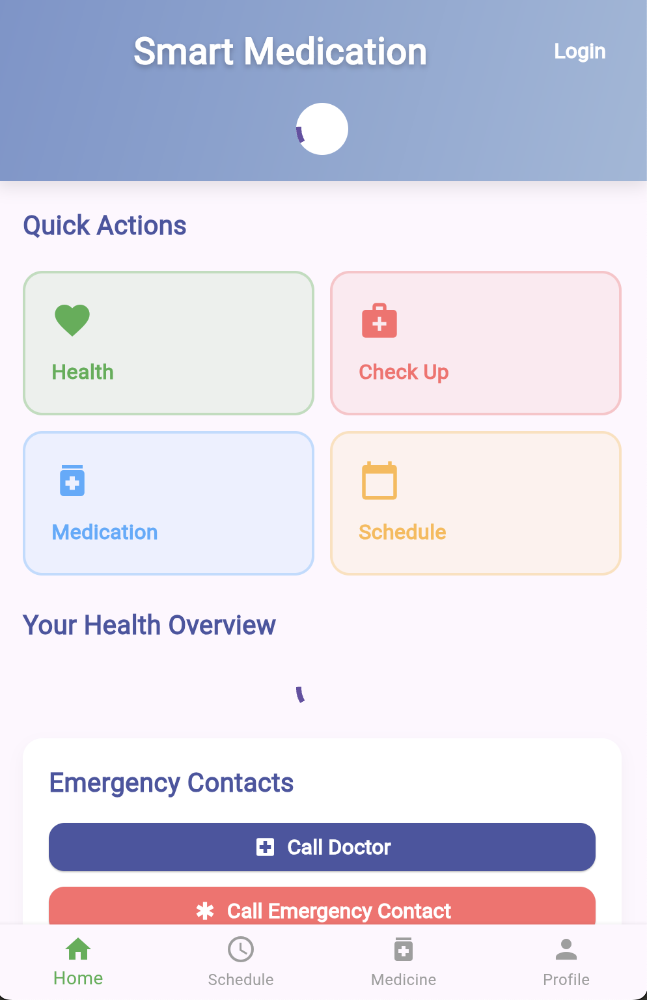
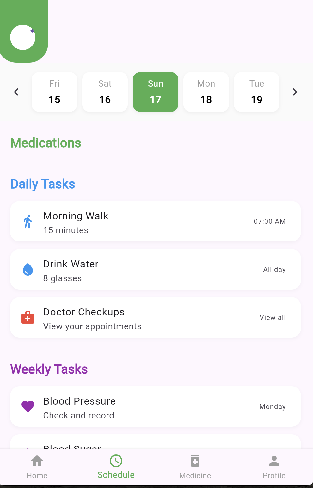
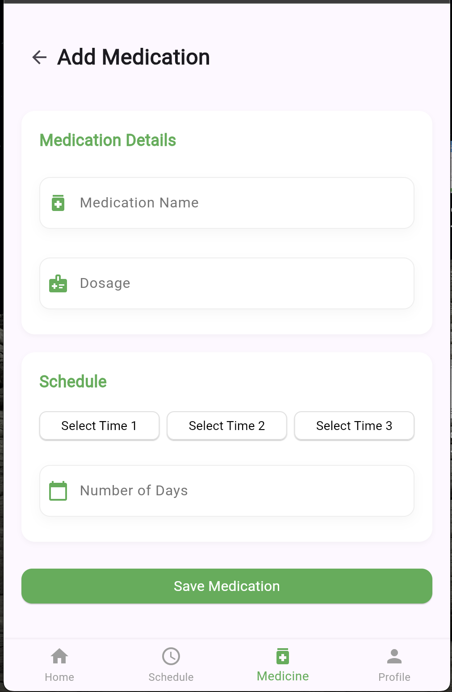
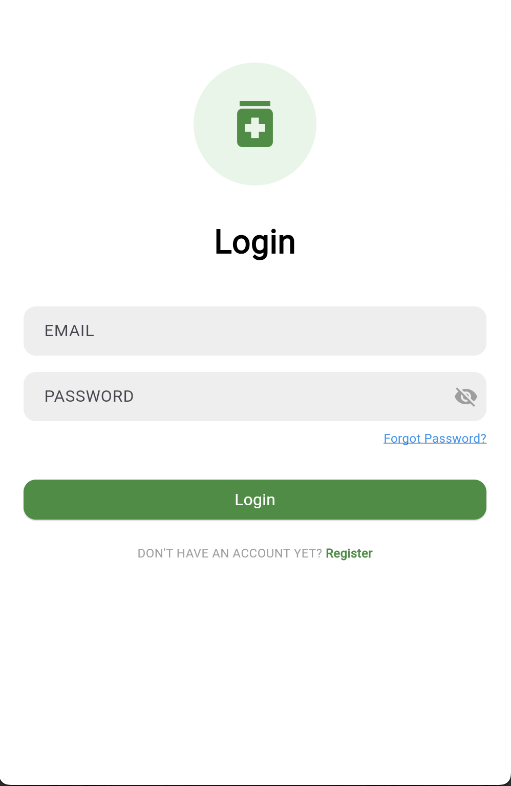

# Smart Medication 🏥💊

A comprehensive Flutter-based mobile application designed to help users manage their medications, track health routines, and maintain wellness schedules.

## 📱 App Overview

Smart Medication is an intuitive health management app that combines medication tracking, daily health routines, and scheduling features to help users maintain their wellness journey.

## ✨ Key Features

### 🏠 **Home Dashboard**
- Quick access to essential health functions
- Health overview and emergency contacts
- Intuitive navigation with visual icons

### 📅 **Smart Scheduling**
- Daily medication reminders
- Customizable health routines
- Weekly health check schedules
- Time-based task management

### 💊 **Medication Management**
- Add and track medications
- Dosage scheduling and reminders
- Medication history and logs
- Multiple time slots per day

### 🏥 **Health Tracking**
- Daily health tasks (walking, hydration)
- Weekly health checkups
- Blood pressure and blood sugar monitoring
- Doctor appointment management

### 👤 **User Profiles**
- Personalized health profiles
- Emergency contact management
- Health goal tracking

## 🖼️ App Screenshots

### Home Screen

*Main dashboard with quick actions for Health, Check Up, Medication, and Schedule*

### Schedule Management

*Daily and weekly task management with medication reminders and health routines*

### Medication Addition

*Easy medication input with dosage and scheduling options*

### User Authentication

*Secure login interface with email and password authentication*


## 🏗️ Project Structure

```
lib/
├── main.dart                 # App entry point
├── models/                   # Data models
│   ├── reminder_model.dart
│   └── reminder_service.dart
├── pages/                    # App screens
│   ├── auth/                # Authentication pages
│   ├── home_page.dart       # Main dashboard
│   ├── scheduling.dart      # Schedule management
│   ├── medication_reminders.dart
│   └── health_page.dart     # Health tracking
├── services/                 # Business logic
│   └── notification_service.dart
├── utils/                    # Helper utilities
│   ├── date_time_utils.dart
│   └── theme.dart
└── widgets/                  # Reusable UI components
    ├── app_scaffold.dart
    ├── custom_button.dart
    └── home_stats_card.dart
```

## 🎨 Features in Detail

### **Smart Reminders**
- Push notifications for medication times
- Customizable reminder sounds and vibrations
- Snooze and reschedule options

### **Health Routines**
- Morning walk tracking (15 minutes)
- Daily water intake monitoring (8 glasses)
- Weekly health check scheduling


## 👨‍💻 Author

**Mohamed Hassan Jibril**
- **GitHub:** [mjibreel](https://github.com/mjibreel)
- **LinkedIn:** [moh-jibril](https://www.linkedin.com/in/moh-jibril)

## 👨‍💻 Developer

**Mohammad Jibreel** - [GitHub Profile](https://github.com/mjibreel)


---

⭐ **Star this repository if you find it helpful!**

🔗 **Visit the app**: [Smart Medication Repository](https://github.com/mjibreel/smart_medication)
